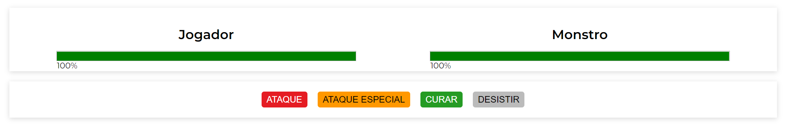
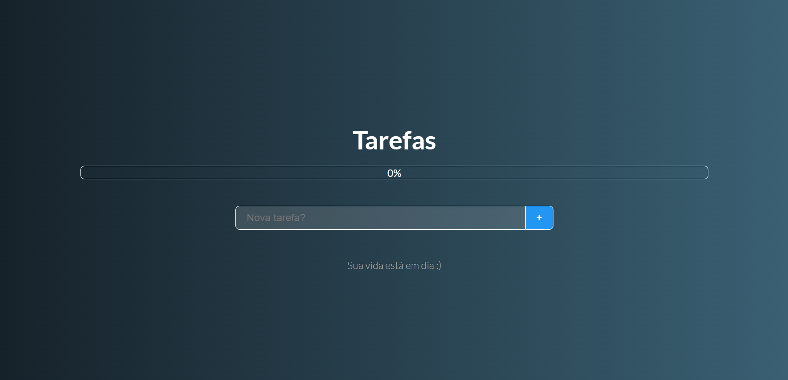
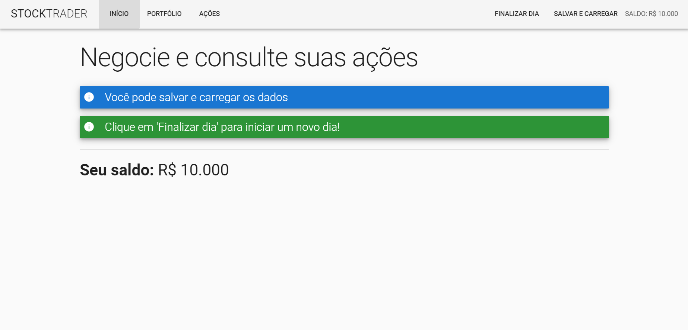

# Vue-JS-2-O-Guia-Completo-incl.-Vue-Router-Vuex
Notes and projects developed in the "Vue JS 2 - O Guia Completo (incl. Vue Router &amp; Vuex)" course, taught by Leonardo Moura Leitao

<h3>Monster Slayer</h3>
The application consists of a logic game whose objective is to slay the monster before your life runs out. A strategy must be thought out, looking for the best way to act! 
 

<h3>To-do List</h3>
This To-do List tool allows you to create new ones, mark them as complete and shows a progress bar according to the number of completions. Creating tasks with duplicate names is not allowed, and all data is written to localStorage. 
 

<h3>Stock Trader</h3>
The idea is an application that simulates trading and stock queries, you have a balance and can choose to buy or sell them. The moment you click on "Finalizar dia" it goes add or subtract over the value of the actions so that these actions can fluctuate in a random way. 
 

